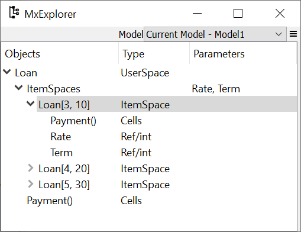

## {{ page.features[0].title }}

**modelx** enables you to build models
just by defining **Formulas** like you do on spreadsheets.
You can define Formulas by writing Python functions.
modelx automatically resolves the calculation order from 
their dependency, so you don't need to write scripts 
to run your models. 
modelx calculates the results when they are retrieved
for the first time, and the results are kept until
they are cleared or recalculated.

```py
>>> import modelx as mx

>>> @mx.defcells
... def Cashflow(t):
...     return 100

>>> @mx.defcells
... def Balance(t):
...     if t > 0:
...         return Balance(t-1) + Cashflow(t)
...     else:
...         return 0
    
>>> Balance(5)
500

>>> dict(Balance)
{0: 0,
 1: 100,
 2: 200,
 3: 300,
 4: 400,
 5: 500}
```


## {{ page.features[1].title }}

Formulas are defined by [Python functions](https://docs.python.org/3/tutorial/controlflow.html#defining-functions),
so you can enjoy the expressivenss of Python syntax.
Python functions are far more readable, understandable
than spreadsheet formulas.

Python have rich [control flows](https://docs.python.org/3/tutorial/controlflow.html),
and built-in [data structures](https://docs.python.org/3/tutorial/datastructures.html)
such as list and dict. All of these are avaialble for defining Formulas.

Objects are referenced by their names in Formulas.
You can also use [lambda expressions](https://docs.python.org/3/tutorial/controlflow.html#lambda-expressions)
to define simple Formulas.

## {{ page.features[2].title }}

modelx is object-oriented. You create, access or make changes to objects, 
such as **Models**, **Spaces** and **Cells**. 
modelx features [composition] and [inheritance] mechanisims common in Object-oriented programming (OOP).

<div class="row">
  <div class="col-sm-6"  style="text-align:center;">
<pre><code class="language-mermaid">
graph TD
A(Model1) --- B[Space1]
B --- C[Cells1]
B --- D[Space2]
D --- E(Cells2)
</code></pre>
  </div>
<div class="col-sm-6">

</div>
</div>

[composition]: https://en.wikipedia.org/wiki/Object_composition
[inheritance]: https://en.wikipedia.org/wiki/Inheritance_(object-oriented_programming)

## {{ page.features[3].title }}

**Parameterization** is a very powerful feature
to quickly and naturally extend a Space written 
in terms of one combination of input values 
into a parameterized Space accepting arbitrary combinations
of input values as arguments.

Using Space parameterization, you can parameterize
Formula calculations without changing their signatures.


```py
>>> space = mx.new_space("Loan")

>>> @mx.defcells
... def Payment():
...     return 1000 * Rate/100 * (1+Rate/100)**Term / ((1+Rate/100)**Term -1)

>>> space.parameters = ("Rate", "Term")

>>> space[3, 10].Payment()
117.23050660515952

>>> for rate, term in zip((3, 4, 5), (10, 20, 30)):
...     print(space[rate, term].Payment())
117.23050660515952
73.58175032862884
65.05143508027656    
```




## {{ page.features[4].title }}

Dependency tracing is an essential feature for checking and validating models. 
You can check what other values each calculated value is using, 
and also what other values it is used by.

```py
>>> Balance.preds(5)
[Model1.Space1.Balance(t=4)=400, Model1.Space1.Cashflow(t=5)=100]

>>> Balance.succs(4)
[Model1.Space1.Balance(t=5)=500]
```


<div class="row">
  <div class="col-sm-6">
    
  </div>
  <div class="col-sm-6">
    
  </div>
</div>

## {{ page.features[5].title }}

Excel files are great for storing data of relatively small sizes. 
You can create new spaces and pupulate new cells in the space with data from Excel files.


## {{ page.features[6].title }}

Spyder is a popular open-source Python IDE. 
Spyder plugin for modelx adds custom IPython consoles and GUI widgets to use modelx with Spyder more intuitively.


## {{ page.features[7].title }}

modelx models are saved as text files written in the Python syntax, 
which means you can take full 
advantage of modern version control systems and collaborative
software development platforms, such as [Git] and [GitHub].

[Git]: https://git-scm.com/
[GitHub]: https://github.com/

## {{ page.features[8].title }}

Documenting models is an integral part of model governance.
modelx enables you to document model components,
such as Models, Spaces and Cells by setting their **doc**
properties. When they are written to files,
they are represented by Python modules and functions,
and their doc propeties are represented by 
the [docstrings] of the Python modules and functions.
Using [Sphinx],
a documentation generator widely used in the Python community
for technical documentation, 
you can generate model documents from the docstrings,
beautifully rendered in HTML, PDF and other formats.

See [lifelib] pages for document samples.
[Sphinx] interpretes [reStructuredText],
a plaintext markup syntax, and
can render math expressions written in LaTex,
images, code samples as well as basic sets
of markups, such as lists and links. 

[docstrings]: https://www.python.org/dev/peps/pep-0257/
[reStructuredText]: https://docutils.sourceforge.io/rst.html
[Sphinx]: https://www.sphinx-doc.org/en/master/
[lifelib]: https://lifelib.io